<div align="center">

# Brain Tumor Detection & Segmentation

### A detector-guided medical imaging research pipeline using YOLO11 and SAM2

[](https://www.python.org/)
[](https://docs.ultralytics.com/)
[](https://docs.ultralytics.com/models/sam-2/)
[](https://www.kaggle.com/datasets/briscdataset/brisc2025)
[](#research-status)

**Localization · Segmentation · Controlled Experiments · Reproducible Evaluation**

</div>

---

## Overview

This repository investigates a two-stage approach for **brain tumor localization and segmentation from contrast-enhanced T1-weighted MRI**.

The central idea is simple:

> **Can a lightweight object detector localize a tumor accurately enough to provide an effective spatial prompt for a foundation segmentation model?**

The pipeline combines **YOLO11** for tumor localization with **SAM2** for mask generation and evaluates both stages against expert-annotated MRI data.

| Component | Design |
|---|---|
| Primary dataset | BRISC 2025 |
| Tumor types | Glioma, Meningioma, Pituitary |
| Negative cases | No-tumor MRI scans |
| Detector study | YOLO11n, YOLO11s, YOLO11m |
| Input study | 512 × 512 and 640 × 640 |
| Segmentation | SAM2 prompted by YOLO boxes |
| Detection metrics | Precision, Recall, mAP@50, mAP@75, mAP@50–95 |
| Segmentation metrics | Dice, IoU, Pixel Precision, Pixel Recall |
| Reproducibility | Fixed seeds, environment metadata, CSV/JSON experiment logs |

---

## Research Pipeline

```mermaid
flowchart LR
    A[BRISC MRI] --> B[Dataset Audit]
    B --> C[Mask-to-Box Conversion]
    C --> D[YOLO11 Training]
    D --> E[Model Comparison]
    E --> F[Best Detector]
    F --> G[Tumor Bounding Box]
    G --> H[SAM2]
    H --> I[Predicted Tumor Mask]
    I --> J[Expert Mask Comparison]
    J --> K[Dice / IoU / Pixel Metrics]
```



The detector is evaluated independently before its bounding boxes are used as prompts for segmentation. This makes it possible to study not only final mask quality, but also how localization errors propagate into the second stage.

---

## Dataset

The project uses **BRISC 2025**, an expert-annotated brain MRI dataset published in *Scientific Data*.

| Property | BRISC 2025 |
|---|---:|
| MRI images | 6,000 |
| Official training set | 5,000 |
| Official test set | 1,000 |
| Segmentation image-mask pairs | 4,793 |
| MRI sequence | Contrast-enhanced T1-weighted |
| Imaging planes | Axial, Coronal, Sagittal |
| Diagnostic classes | Glioma, Meningioma, Pituitary, No Tumor |

**Dataset:** [Kaggle — BRISC 2025](https://www.kaggle.com/datasets/briscdataset/brisc2025)  
**Dataset paper:** [Fateh et al., Scientific Data (2026)](https://doi.org/10.1038/s41597-026-06753-y)

The dataset is **not committed to this repository**. This keeps the repository lightweight and preserves the dataset's original distribution and citation path.

---

## Experimental Protocol

### Detection formulation

The object detector predicts three tumor classes:

| ID | Target |
|---:|---|
| 0 | Glioma |
| 1 | Meningioma |
| 2 | Pituitary |

**No-tumor scans are retained as negative examples with empty YOLO label files.** They are not represented by artificial "no tumor" bounding boxes.

For tumor-positive scans, YOLO bounding boxes are derived directly from the expert segmentation masks.

### Data split policy

The official BRISC **test set is kept untouched during model development**.

Validation data are created only from the official training partition using a fixed seed and stratification by:

- tumor class
- MRI plane

BRISC does not expose complete patient identifiers. Therefore, strict patient-disjoint splitting cannot be independently guaranteed. This limitation is documented rather than hidden.

---

## Experiments

The default detector experiment is a controlled comparison across model capacity and input resolution.

| Experiment | Values |
|---|---|
| Architecture | YOLO11n · YOLO11s · YOLO11m |
| Image size | 512 · 640 |
| Epochs | 100 |
| Seed | 42 |
| Model-selection split | Validation |
| Final evaluation split | Official BRISC test |

Each run records its configuration and results automatically.

### Detection evaluation

The detector is assessed using:

- **Precision**
- **Recall**
- **mAP@50**
- **mAP@75**
- **mAP@50–95**
- **Inference latency**

Ordinary classification accuracy is not used as the main detection metric because the task requires both correct class prediction and spatial localization.

### Segmentation evaluation

YOLO detections are passed to SAM2 as bounding-box prompts.

The resulting masks are compared with the expert BRISC masks using:

- **Dice coefficient**
- **Intersection over Union**
- **Pixel precision**
- **Pixel recall**
- **Detection coverage**
- **Per-class performance**

---

## Published BRISC Reference Baselines

These values come from the **BRISC dataset paper** and are included only as external context. They are **not claimed as results produced by this repository**.

| Task | Model | Published result |
|---|---|---:|
| Classification | EfficientNetB0 | Accuracy **99.20%** |
| Classification | EfficientNetB0 | Weighted F1 **99.20%** |
| Segmentation | SaberNet | Weighted mIoU **80.60%** |
| Segmentation | U-Net | Weighted mIoU **75.70%** |

The purpose of this repository is not to reproduce those exact architectures. Instead, it studies a different question: **how well a lightweight detector can guide a general segmentation model in a two-stage tumor-analysis pipeline.**

---

## Research Status

| Stage | Status |
|---|---|
| BRISC dataset auditing | ✅ Implemented |
| Mask → YOLO label conversion | ✅ Implemented |
| Reproducible train/val/test preparation | ✅ Implemented |
| YOLO11 training pipeline | ✅ Implemented |
| Multi-model / multi-resolution experiments | ✅ Implemented |
| Detection metric export | ✅ Implemented |
| YOLO → SAM2 integration | ✅ Implemented |
| Dice / IoU segmentation benchmark | ✅ Implemented |
| Full BRISC GPU experiment results | ⏳ Compute run required |

The repository intentionally does not contain fabricated or hand-entered experimental scores. Model metrics are written automatically by the experiment code when training and evaluation are executed.

---

## Reproducible Workflow

### 1. Install

```bash
git clone https://github.com/Ibrahimshah0900/Tumor-Detection.git
cd Tumor-Detection

python -m venv .venv
pip install -r requirements.txt
```

### 2. Audit BRISC

```bash
python "Tumor detection.py" audit-brisc \
  --dataset-root /path/to/brisc2025 \
  --output outputs/dataset_audit
```

### 3. Prepare YOLO data

```bash
python "Tumor detection.py" prepare-brisc \
  --dataset-root /path/to/brisc2025 \
  --output datasets/brisc_yolo \
  --validation-fraction 0.15 \
  --seed 42 \
  --clean
```

### 4. Run the detector study

```bash
python "Tumor detection.py" experiment \
  --data datasets/brisc_yolo/data.yaml \
  --models yolo11n.pt yolo11s.pt yolo11m.pt \
  --imgsz 512 640 \
  --epochs 100 \
  --batch 16 \
  --split val \
  --seed 42
```

### 5. Evaluate detector-guided segmentation

```bash
python "Tumor detection.py" benchmark-segmentation \
  --weights runs/tumor_detection/<run>/weights/best.pt \
  --dataset-root /path/to/brisc2025 \
  --sam-model sam2.1_b.pt \
  --split test \
  --imgsz 640
```

---

## Experiment Outputs

The code exports machine-readable artifacts instead of requiring manual result transcription.

```text
runs/tumor_detection/
├── research_<timestamp>/
│   ├── experiment_config.json
│   ├── experiment_results.csv
│   ├── experiment_results.json
│   └── experiment_ranking.json
└── segmentation_benchmark_<timestamp>/
    ├── segmentation_metrics.csv
    ├── segmentation_metrics.json
    └── segmentation_summary.json
```

Environment information such as Python, PyTorch, Ultralytics, CUDA availability, GPU model, seed, image size and timing information is recorded with the experiments.

---

## Repository

```text
Tumor-Detection/
├── Tumor detection.py
├── requirements.txt
├── .gitignore
└── README.md
```

The main Python file contains the complete research workflow:

```text
audit-brisc
prepare-brisc
train
evaluate
experiment
predict
benchmark-segmentation
```

---

## Limitations

- BRISC contains 2D single-slice MRI rather than complete 3D volumes.
- Complete patient identifiers are unavailable, so patient-disjoint evaluation cannot be independently verified.
- Results may vary across hardware and package versions despite deterministic settings.
- A missed YOLO detection prevents the downstream SAM2 stage from receiving a useful tumor prompt.
- BRISC contains contrast-enhanced T1-weighted data; performance should not be assumed to transfer directly to other MRI sequences or institutions.
- This is a **research prototype**, not a clinical diagnostic system.

---

## Research Directions

This framework can be extended into several stronger studies:

- cross-plane generalization
- uncertainty and confidence calibration
- small-tumor sensitivity analysis
- comparison with U-Net / Attention U-Net baselines
- detector-free versus detector-guided SAM2 prompting
- domain-shift evaluation on an external MRI dataset
- 3D or multi-slice extensions
- computational efficiency versus segmentation-quality analysis

---

## Citation

If BRISC is used, cite the original dataset paper:

```bibtex
@article{fateh2026brisc,
  title   = {BRISC: Annotated Dataset for Brain Tumor Segmentation and Classification},
  author  = {Fateh, Amirreza and Rezvani, Yasin and Moayedi, Sara and Rezvani, Sadjad and Fateh, Fatemeh and Fateh, Mansoor and Abolghasemi, Vahid},
  journal = {Scientific Data},
  volume  = {13},
  article = {361},
  year    = {2026},
  doi     = {10.1038/s41597-026-06753-y}
}
```

---

<div align="center">

### Muhammad Ibrahim Hashmi

**BS Artificial Intelligence**

Computer Vision · Medical AI · Deep Learning · Applied Machine Learning

[GitHub](https://github.com/Ibrahimshah0900)

</div>
